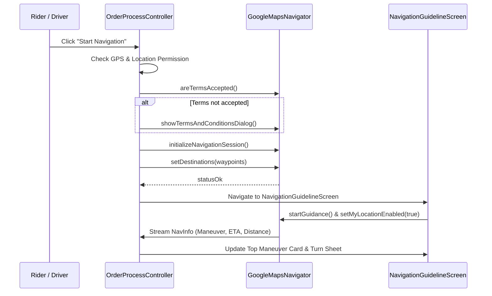

# 🗺️ Complete Google Maps & Navigation Implementation Guide

> **Target Project:** Flutter (Android & iOS)  
> **Source Projects:** `nicholaslim80Rider` & `nicholaslim80User` (ZipBee)  
> **Author:** DeepMind / Antigravity AI  
> **Purpose:** এই গাইডটি দেখে যেকোনো নতুন ডেভেলপার একদম স্ক্র্যাচ থেকে একটি নতুন Flutter অ্যাপে Google Maps, Address Picker, Multi-stop Road Polylines, Dynamic Custom Markers, Geofence Radius এবং Google Turn-by-Turn In-App Navigation Guideline ইমপ্লিমেন্ট করতে পারবে।

---

## 📑 সূচিপত্র (Table of Contents)

1. [Google Maps API Key টেস্টিং ও ভেরিফিকেশন (API Testing Guide)](#1-google-maps-api-key-টেস্টিং-ও-ভেরিফিকেশন)
2. [Google Cloud Console সেটআপ ও পারমিশন (Cloud Console Setup)](#2-google-cloud-console-সেটআপ-ও-পারমিশন)
3. [নেটিভ প্ল্যাটফর্ম কনফিগারেশন (Android & iOS Setup)](#3-নেটিভ-প্ল্যাটফর্ম-কনফিগারেশন)
4. [কোর আর্কিটেকচার ও ডিপেন্ডেন্সিজ (Architecture & Dependencies)](#4-কোর-আর্কিটেকচার-ও-ডিপেন্ডেন্সিজ)
5. [কাস্টম মার্কার ক্যানভাস জেনারেশন (Custom Marker Engine)](#5-কাস্টম-মার্কার-ক্যানভাস-জেনারেশন)
6. [রোড পলিলিন ইঞ্জিন: OSRM + Google Directions (Polyline Routing Engine)](#6-রোড-পলিলিন-ইঞ্জিন-osrm--google-directions)
7. [ম্যাপ উইজেট: Address Picker ও Multi-Stop Display (GoogleMapWidget Architecture)](#7-ম্যাপ-উইজেট-address-picker-ও-multi-stop-display)
8. [ইন্টারেক্টিভ রেডিয়াস ও জিওফেন্স ম্যাপ (Radius / Geofence Feature)](#8-ইন্টারেক্টিভ-রেডিয়াস-ও-জিওফেন্স-ম্যাপ)
9. [🔥 স্পেশাল ফিচার: Turn-by-Turn Navigation Guideline (Google Navigation SDK)](#9--স্পেশাল-ফিচার-turn-by-turn-navigation-guideline)
10. [সাধারণ সমস্যা ও সমাধান (Troubleshooting & Debugging)](#10-সাধারণ-সমস্যা-ও-সমাধান)

---

## 1. Google Maps API Key টেস্টিং ও ভেরিফিকেশন

একটি API Key-তে কোন কোন ফিচার বা Google Maps API সার্ভিস সক্রিয় (Enable) আছে এবং কোনো রেস্ট্রিকশন বা বিলিং সমস্যা আছে কিনা তা সহজেই টার্মিনাল (`curl`) দিয়ে টেস্ট করা যায়।

### ক. Geocoding API টেস্ট
যেকোনো অ্যাড্রেস থেকে Lat/Lng পাওয়ার সার্ভিস:
```bash
curl -s "https://maps.googleapis.com/maps/api/geocode/json?address=Singapore&key=YOUR_API_KEY"
```
- **সফল রেসপন্স:** `"status": "OK"` এবং কোঅর্ডিনেট ডাটা আসবে।
- **ব্যর্থতা:** `"status": "REQUEST_DENIED"` বা `"error_message": "This API project is not authorized to use this API."` (Geocoding API এনাবল করা নেই)।

---

### খ. Directions API টেস্ট
দুটো লোকেশনের মধ্যে গাড়ি চলার রাস্তা এবং টার্ন স্টেপস পাওয়ার সার্ভিস:
```bash
curl -s "https://maps.googleapis.com/maps/api/directions/json?origin=1.3521,103.8198&destination=1.3000,103.8000&mode=driving&key=YOUR_API_KEY"
```
- **সফল রেসপন্স:** `"status": "OK"`, `"routes"` অ্যারেতে polyline এবং step-by-step দিকনির্দেশনা থাকবে।
- **ব্যর্থতা:** `"status": "OVER_QUERY_LIMIT"` বা `"REQUEST_DENIED"`.

---

### গ. Places Autocomplete API টেস্ট
সার্চ বক্সে টেক্সট লেখার সময় সাজেশন আসার সার্ভিস:
```bash
curl -s "https://maps.googleapis.com/maps/api/place/autocomplete/json?input=Marina&key=YOUR_API_KEY"
```
- **সফল রেসপন্স:** `"status": "OK"` এবং `"predictions"` এর তালিকা আসবে।

---

### ঘ. Distance Matrix API টেস্ট
```bash
curl -s "https://maps.googleapis.com/maps/api/distancematrix/json?origins=1.3521,103.8198&destinations=1.3000,103.8000&key=YOUR_API_KEY"
```

---

### ⚠️ Native Maps SDK for Android & iOS এর স্ট্যাটাস বোঝার নিয়ম
Android এবং iOS নেটিভ গুগল ম্যাপসের জন্য **Google Maps SDK for Android** এবং **Google Maps SDK for iOS** এনাবল থাকতে হয়।
- যদি `curl` এ Geocoding/Directions কাজ করে কিন্তু মোবাইল অ্যাপে ম্যাপ গ্রে/ব্ল্যাঙ্ক থাকে এবং ডিবাগ কনসোলে:
  ```text
  requestLegend unsuccessful for epoch -1 legend ROADMAP
  urls for epoch -1 not available.
  ```
  এর মানে:
  1. Google Cloud Console-এ **Maps SDK for Android** এনাবল করা নেই।
  2. API Key-তে **Android Application Restriction** দেওয়া আছে কিন্তু আপনার প্যাকেজ নাম (`sg.com.zipbee.driver`) বা কম্পিউটারের **SHA-1 Fingerprint** অ্যাড করা নেই।
  3. গুগল ক্লাউড প্রোজেক্টে **Billing Account** যুক্ত নেই।

---

## 2. Google Cloud Console সেটআপ ও পারমিশন

Google Cloud Console (`console.cloud.google.com`) এ গিয়ে নিশ্চিত করুন:

1. **APIs & Services > Library** থেকে নিচের API গুলো **Enable** করুন:
   - ✅ **Maps SDK for Android**
   - ✅ **Maps SDK for iOS**
   - ✅ **Navigation SDK for Android / iOS** (Turn-by-turn Navigation এর জন্য)
   - ✅ **Directions API**
   - ✅ **Geocoding API**
   - ✅ **Places API (New)**

2. **Credentials > API Key Settings:**
   - **Application Restrictions:**
     - ডেভেলপমেন্ট চলাকালীন সাময়িকভাবে **"None"** রাখতে পারেন।
     - প্রোডাকশনে **"Android apps"** দিয়ে আপনার অ্যাপের Package Name (`sg.com.your_app`) এবং রিলিজ ও ডিবাগ কি-স্টোরের SHA-1 যুক্ত করবেন।
     - ⚠️ **সতর্কতা:** মোবাইল অ্যাপের API Key-তে কখনোই *"HTTP Referrers (Websites)"* রেস্ট্রিকশন সিলেক্ট করবেন না।
   - **API Restrictions:**
     - "Don't restrict key" অথবা উপরের সবকটি ম্যাপ সার্ভিস টিক দিন।

---

## 3. নেটিভ প্ল্যাটফর্ম কনফিগারেশন

### 🤖 Android Setup

#### ১. `android/app/build.gradle.kts`
`.env` থেকে ডায়নামিকভাবে API Key লোড করা এবং Fallback কনফিগার করা:

```kotlin
import java.util.Properties

val envProperties = Properties()
val envFile = sequenceOf(
    project.rootProject.file("../.env"),
    project.rootProject.file(".env")
).firstOrNull { it.exists() }

if (envFile != null) {
    envFile.forEachLine { line ->
        if (line.isNotBlank() && !line.startsWith("#") && line.contains("=")) {
            val parts = line.split("=", limit = 2)
            envProperties.setProperty(parts[0].trim(), parts[1].trim())
        }
    }
}
val googleMapsApiKey = envProperties.getProperty("GOOGLE_MAPS_API_KEY")?.trim()?.takeIf { it.isNotEmpty() }
    ?: "YOUR_FALLBACK_API_KEY"

android {
    defaultConfig {
        applicationId = "sg.com.zipbee.driver"
        minSdk = flutter.minSdkVersion
        targetSdk = flutter.targetSdkVersion
        
        // Manifest placeholder injection
        manifestPlaceholders["GOOGLE_MAPS_API_KEY"] = googleMapsApiKey
    }
}
```

#### ২. `android/app/src/main/AndroidManifest.xml`
```xml
<manifest xmlns:android="http://schemas.android.com/apk/res/android">

    <!-- Location & Foreground Permissions -->
    <uses-permission android:name="android.permission.INTERNET" />
    <uses-permission android:name="android.permission.ACCESS_FINE_LOCATION" />
    <uses-permission android:name="android.permission.ACCESS_COARSE_LOCATION" />
    <uses-permission android:name="android.permission.ACCESS_BACKGROUND_LOCATION" />
    <uses-permission android:name="android.permission.FOREGROUND_SERVICE" />
    <uses-permission android:name="android.permission.FOREGROUND_SERVICE_LOCATION" />

    <application
        android:label="ZipBee Driver"
        android:name="${applicationName}"
        android:icon="@mipmap/ic_launcher">

        <!-- Google Maps API Key Meta-Data -->
        <meta-data
            android:name="com.google.android.geo.API_KEY"
            android:value="${GOOGLE_MAPS_API_KEY}" />

    </application>
</manifest>
```

#### ৩. `lib/main.dart` এ Latest Maps Renderer ইনিশিয়ালাইজেশন
```dart
void main() async {
  WidgetsFlutterBinding.ensureInitialized();

  final GoogleMapsFlutterPlatform mapsImplementation =
      GoogleMapsFlutterPlatform.instance;
  if (mapsImplementation is GoogleMapsFlutterAndroid) {
    try {
      mapsImplementation.useAndroidViewSurface = true;
      mapsImplementation.initializeWithRenderer(AndroidMapRenderer.latest);
      debugPrint('🗺️ [GoogleMaps] Android Hybrid Composition & Latest Renderer requested.');
    } catch (e) {
      debugPrint('⚠️ [GoogleMaps] Error setting renderer: $e');
    }
  }

  await dotenv.load(fileName: ".env");
  runApp(const MyApp());
}
```

---

### 🍏 iOS Setup

#### ১. `ios/Runner/AppDelegate.swift`
```swift
import Flutter
import UIKit
import GoogleMaps

@main
@objc class AppDelegate: FlutterAppDelegate {
  override func application(
    _ application: UIApplication,
    didFinishLaunchingWithOptions launchOptions: [UIApplication.LaunchOptionsKey: Any]?
  ) -> Bool {
    let mapsKey = (Bundle.main.object(forInfoDictionaryKey: "GoogleMapsApiKey") as? String)?.trimmingCharacters(in: .whitespacesAndNewlines)
    let keyToUse = (mapsKey != nil && !mapsKey!.isEmpty) ? mapsKey! : "YOUR_FALLBACK_API_KEY"
    GMSServices.provideAPIKey(keyToUse)
    
    GeneratedPluginRegistrant.register(with: self)
    return super.application(application, didFinishLaunchingWithOptions: launchOptions)
  }
}
```

#### ২. `ios/Runner/Info.plist`
```xml
<dict>
    <key>GoogleMapsApiKey</key>
    <string>YOUR_GOOGLE_MAPS_API_KEY</string>
    <key>NSLocationWhenInUseUsageDescription</key>
    <string>We need your location to show pickup and dropoff routes.</string>
    <key>NSLocationAlwaysAndWhenInUseUsageDescription</key>
    <string>We need background location to track live delivery progress.</string>
</dict>
```

---

## 4. কোর আর্কিটেকচার ও ডিপেন্ডেন্সিজ

`pubspec.yaml` ডিপেন্ডেন্সিজ:
```yaml
dependencies:
  flutter:
    sdk: flutter
  get: ^4.6.6
  google_maps_flutter: ^2.14.0
  google_maps_flutter_android: ^2.18.6
  google_maps_flutter_platform_interface: ^2.10.0
  google_navigation_flutter: ^0.4.0
  flutter_polyline_points: ^2.1.0
  location: ^7.0.1
  geolocator: ^13.0.2
  flutter_dotenv: ^5.2.1
  http: ^1.3.0
```

---

## 5. কাস্টম মার্কার ক্যানভাস জেনারেশন (Custom Marker Engine)

ডিজাইনে মার্কারগুলো সাধারণ পিন নয়; এগুলো ভেক্টর ক্যানভাসে ড্র করা সুন্দর টিয়ারড্রপ শেইপ, ড্রপ শ্যাডো এবং নাম্বার ব্যাজ সম্বলিত মার্কার।

ফাইল: [`lib/core/utils/custom_map_marker_helper.dart`](file:///Users/nuhan/Shahriar_Shanto/nicholaslim80Rider/lib/core/utils/custom_map_marker_helper.dart)

### কালার গাইড
- 🔵 **Blue Pin (`#0D5C9E`):** পিকআপ লোকেশন (Pickup / Sender)
- 🟡 **Yellow Pin (`#FFCC00`):** ড্রাইভার / রাইডার লোকেশন (Rider / Driver)
- 🟢 **Green Pin (`#37C759`):** ইউজারের নিজস্ব লোকেশন (Device Location)
- 🔴 **Red Pin (`#FF3B30`):** ড্রপ অফ / ডেলিভারি গন্তব্য (Single Drop)
- 🔴 **Numbered Red Pin (`#FF3B30`):** মাল্টি-ড্রপের ক্ষেত্রে স্টপ নম্বর (Drop 1, Drop 2, Drop N)

### ক্যানভাস ড্রয়িং লজিক
```dart
class CustomMapMarkerHelper {
  static const Color bluePinColor = Color(0xFF0D5C9E);
  static const Color greenPinColor = Color(0xFF37C759);
  static const Color yellowPinColor = Color(0xFFFFCC00);
  static const Color redPinColor = Color(0xFFFF3B30);

  static const Offset defaultAnchor = Offset(0.5, 0.925);
  static final Map<String, BitmapDescriptor> _iconCache = {};

  static Future<BitmapDescriptor> getPickupMarker({double size = 120.0}) async {
    return _getCachedOrGenerate('pickup_${size.toInt()}', bluePinColor, null, size);
  }

  static Future<BitmapDescriptor> getRiderMarker({double size = 120.0}) async {
    return _getCachedOrGenerate('rider_${size.toInt()}', yellowPinColor, null, size);
  }

  static Future<BitmapDescriptor> getDeviceLocationMarker({double size = 120.0}) async {
    return _getCachedOrGenerate('device_${size.toInt()}', greenPinColor, null, size);
  }

  static Future<BitmapDescriptor> getDropMarker({double size = 120.0}) async {
    return _getCachedOrGenerate('drop_${size.toInt()}', redPinColor, null, size);
  }

  static Future<BitmapDescriptor> getNumberedDropMarker({
    required int number,
    double size = 120.0,
  }) async {
    return _getCachedOrGenerate('numbered_${number}_${size.toInt()}', redPinColor, number, size);
  }

  static Future<BitmapDescriptor> _getCachedOrGenerate(
    String key,
    Color color,
    int? number,
    double size,
  ) async {
    if (_iconCache.containsKey(key)) return _iconCache[key]!;
    final icon = await createCustomMarker(pinColor: color, number: number, size: size);
    _iconCache[key] = icon;
    return icon;
  }

  static Future<BitmapDescriptor> createCustomMarker({
    required Color pinColor,
    int? number,
    double size = 120.0,
  }) async {
    final double width = size;
    final double height = size * 1.333;

    final ui.PictureRecorder pictureRecorder = ui.PictureRecorder();
    final Canvas canvas = Canvas(pictureRecorder);

    final double cx = width / 2.0;
    final double cy = width * 0.40;
    final double outerRadius = width * 0.35;
    final double outerTipY = height - (width * 0.10);

    // 1. Drop Shadow
    final Paint shadowPaint = Paint()
      ..color = Colors.black.withOpacity(0.20)
      ..style = PaintingStyle.fill
      ..maskFilter = const MaskFilter.blur(BlurStyle.normal, 4.0);
    canvas.drawOval(
      Rect.fromCenter(center: Offset(cx, outerTipY + 2.0), width: width * 0.42, height: width * 0.15),
      shadowPaint,
    );

    // 2. Outer White Teardrop
    final Path borderPath = Path()
      ..moveTo(cx, outerTipY)
      ..cubicTo(cx - outerRadius * 0.85, cy + outerRadius * 1.2, cx - outerRadius, cy + outerRadius * 0.4, cx - outerRadius, cy)
      ..arcTo(Rect.fromCircle(center: Offset(cx, cy), radius: outerRadius), math.pi, math.pi, false)
      ..cubicTo(cx + outerRadius, cy + outerRadius * 0.4, cx + outerRadius * 0.85, cy + outerRadius * 1.2, cx, outerTipY)
      ..close();
    canvas.drawPath(borderPath, Paint()..color = Colors.white..isAntiAlias = true);

    // 3. Inner Colored Teardrop
    final double innerRadius = width * 0.30;
    final double innerTipY = outerTipY - (width * 0.067);
    final Path pinPath = Path()
      ..moveTo(cx, innerTipY)
      ..cubicTo(cx - innerRadius * 0.85, cy + innerRadius * 1.2, cx - innerRadius, cy + innerRadius * 0.4, cx - innerRadius, cy)
      ..arcTo(Rect.fromCircle(center: Offset(cx, cy), radius: innerRadius), math.pi, math.pi, false)
      ..cubicTo(cx + innerRadius, cy + innerRadius * 0.4, cx + innerRadius * 0.85, cy + innerRadius * 1.2, cx, innerTipY)
      ..close();
    canvas.drawPath(pinPath, Paint()..color = pinColor..isAntiAlias = true);

    // 4. White Center Circle
    final double whiteCircleRadius = width * 0.175;
    canvas.drawCircle(Offset(cx, cy), whiteCircleRadius, Paint()..color = Colors.white..isAntiAlias = true);

    // 5. Content (Number Text or Center Dot)
    if (number != null) {
      final textPainter = TextPainter(textDirection: ui.TextDirection.ltr, textAlign: TextAlign.center);
      textPainter.text = TextSpan(
        text: number.toString(),
        style: TextStyle(fontSize: width * 0.22, color: pinColor, fontWeight: FontWeight.w900, height: 1.0),
      );
      textPainter.layout();
      textPainter.paint(canvas, Offset(cx - (textPainter.width / 2.0), cy - (textPainter.height / 2.0)));
    } else {
      canvas.drawCircle(Offset(cx, cy), whiteCircleRadius * 0.52, Paint()..color = pinColor..isAntiAlias = true);
    }

    final ui.Image image = await pictureRecorder.endRecording().toImage(width.toInt(), height.toInt());
    final ByteData? byteData = await image.toByteData(format: ui.ImageByteFormat.png);
    return BitmapDescriptor.fromBytes(byteData!.buffer.asUint8List());
  }
}
```

---

## 6. রোড পলিলিন ইঞ্জিন: OSRM + Google Directions

সোজা সরলরেখা টানার বদলে গাড়ির চলাচলের সত্যিকারের রাস্তা অনুসরণ করার জন্য হাইব্রিড পলিলিন ইঞ্জিন ব্যবহার করা হয়েছে:

1. **Primary: OSRM (Open Source Routing Machine)** — দ্রুত রেসপন্স, আনলিমিটেড কোটা এবং ফ্রি।
2. **Fallback: Google Directions API** — যদি OSRM সাময়িকভাবে ডাউন থাকে বা পয়েন্ট মিস করে।

ফাইল: [`lib/core/services/osrm_route_service.dart`](file:///Users/nuhan/Shahriar_Shanto/nicholaslim80Rider/lib/core/services/osrm_route_service.dart)

```dart
class OsrmRouteService {
  static double calculateDistanceMeters(LatLng p1, LatLng p2) {
    const earthRadius = 6371000.0;
    final dLat = (p2.latitude - p1.latitude) * (math.pi / 180.0);
    final dLng = (p2.longitude - p1.longitude) * (math.pi / 180.0);
    final a = math.sin(dLat / 2) * math.sin(dLat / 2) +
        math.cos(p1.latitude * (math.pi / 180.0)) *
            math.cos(p2.latitude * (math.pi / 180.0)) *
            math.sin(dLng / 2) *
            math.sin(dLng / 2);
    return earthRadius * (2 * math.atan2(math.sqrt(a), math.sqrt(1 - a)));
  }

  static Future<List<LatLng>> getRoutePoints(List<LatLng> waypoints) async {
    if (waypoints.length < 2) return waypoints;

    // 1. Try OSRM first
    final osrmPoints = await fetchRoadPolyline(waypoints);
    if (osrmPoints.length > 2) return osrmPoints;

    // 2. Fallback to Google Directions API
    try {
      final polylinePoints = PolylinePoints.legacy(googleMapApiKey);
      final result = await polylinePoints.getRouteBetweenCoordinates(
        request: PolylineRequest(
          origin: PointLatLng(waypoints.first.latitude, waypoints.first.longitude),
          destination: PointLatLng(waypoints.last.latitude, waypoints.last.longitude),
          mode: TravelMode.driving,
          wayPoints: waypoints.length > 2
              ? waypoints.sublist(1, waypoints.length - 1)
                  .map((p) => PolylineWayPoint(location: '${p.latitude},${p.longitude}')).toList()
              : [],
        ),
      );
      final googlePoints = result.points.map((p) => LatLng(p.latitude, p.longitude)).toList();
      if (googlePoints.length >= 2) return googlePoints;
    } catch (_) {}

    return waypoints;
  }
}
```

---

## 7. ম্যাপ উইজেট: Address Picker ও Multi-Stop Display

ফাইল: [`lib/features/google_map/widget/google_map_widget.dart`](file:///Users/nuhan/Shahriar_Shanto/nicholaslim80Rider/lib/features/google_map/widget/google_map_widget.dart)

### উইজেট মোড (Widget Modes)
1. **`GoogleMapWidgetMode.display`**:
   - একাধিক স্টপ (Pickup -> Drop 1 -> Drop 2 ...) ব্লু কালারের রোড লাইনে দেখায়।
   - ড্রাইভারের বর্তমান অবস্থান থেকে প্রথম পিকআপ পয়েন্ট পর্যন্ত লাইভ ইয়োলো লাইন আঁকে।
   - স্বয়ংক্রিয়ভাবে ক্যামেরা জুম এবং বাউন্ড ফিট (`_fitCameraToRoute`) করে।
2. **`GoogleMapWidgetMode.addressPicker`**:
   - উপরে ফ্লোটিং সার্চ বার (Singapore OneMap Search API দিয়ে বিল্ডিং/পোস্টাল কোড সাজেশন)।
   - সার্চ রেজাল্ট ড্রপডাউন ওভারলে।
   - ম্যাপের যেকোনো জায়গায় ট্যাপ করলে রিভার্স জিওকোডিং হয়ে অ্যাড্রেস ও পিন সিলেক্ট হয়।
   - নিচে ফ্লোটিং কার্ডে অ্যাড্রেস, পোস্টাল কোড ও **"Use"** কনফার্মেশন বাটন।

### ব্যবহারের উদাহরণ (Usage Examples)

#### ১. ঠিকানা বাছাই ডায়ালগে (Address Picker)
```dart
GoogleMapWidget(
  mode: GoogleMapWidgetMode.addressPicker,
  initialQuery: "730123",
  onLocationConfirmed: (OneMapResolvedAddress resolved) {
    print("Selected: ${resolved.address}, Postal: ${resolved.postalCode}");
    Get.back(result: resolved);
  },
)
```

#### ২. অর্ডার রুটের বিস্তারিত দেখতে (Display Mode)
```dart
GoogleMapWidget(
  mode: GoogleMapWidgetMode.display,
  routeStops: [
    OneMapRouteStop(latitude: 1.3521, longitude: 103.8198, address: "Pickup Warehouse", stopType: "PICKUP", sequence: 1),
    OneMapRouteStop(latitude: 1.3650, longitude: 103.8300, address: "Delivery Point A", stopType: "DROP", sequence: 2),
    OneMapRouteStop(latitude: 1.3700, longitude: 103.8400, address: "Delivery Point B", stopType: "DROP", sequence: 3),
  ],
  showZoomButtons: true,
)
```

---

## 8. ইন্টারেক্টিভ রেডিয়াস ও জিওফেন্স ম্যাপ

ড্রাইভার কত কিলোমিটারের মধ্যে অর্ডার এক্সেপ্ট করতে চায় তা নির্বাচন করার জন্য সার্কুলার জিওফেন্স ম্যাপ।

ফাইল: [`lib/features/driver_preference/distance_radius/screen/distance_radius_screen.dart`](file:///Users/nuhan/Shahriar_Shanto/nicholaslim80Rider/lib/features/driver_preference/distance_radius/screen/distance_radius_screen.dart)

### মূল লজিক:
```dart
// Reactive Circle on GoogleMap
Circle(
  circleId: const CircleId('radius_geofence'),
  center: currentLocation,
  radius: radiusInKilometers * 1000, // মিটার কনভার্সন
  fillColor: Colors.amber.withOpacity(0.20),
  strokeColor: Colors.amber,
  strokeWidth: 2,
)
```

---

## 9. 🔥 স্পেশাল ফিচার: Turn-by-Turn Navigation Guideline

এটি রাইড শেয়ারিং ও ডেলিভারি অ্যাপের সবচেয়ে গুরুত্বপূর্ণ অংশ। Google Maps-এর **Turn-by-Turn ইন-অ্যাপ নেভিগেশন** সরাসরি অ্যাপের ভেতরে রেন্ডার করা হয় (`google_navigation_flutter` প্যাকেজ ব্যবহার করে)।

ফাইলসমূহ:
- UI স্ক্রিন: [`lib/features/order_progress/screen/navigation_guideline_screen.dart`](file:///Users/nuhan/Shahriar_Shanto/nicholaslim80Rider/lib/features/order_progress/screen/navigation_guideline_screen.dart)
- কন্ট্রোলার: [`lib/features/order_progress/controller/order_process_controller.dart`](file:///Users/nuhan/Shahriar_Shanto/nicholaslim80Rider/lib/features/order_progress/controller/order_process_controller.dart)

---

### নেভিগেশনের সম্পূর্ণ লাইফসাইকেল (Step-by-Step Flow)



---

### ১. নেভিগেশন সেশন স্টার্ট ও রুট ক্যালকুলেশন

```dart
Future<void> startInAppNavigation() async {
  // ১. GPS ও পারমিশন চেক
  bool serviceEnabled = await Geolocator.isLocationServiceEnabled();
  if (!serviceEnabled) {
    EasyLoading.showError('GPS is turned off. Please enable location.');
    return;
  }

  // ২. গুগল টার্মস ও কন্ডিশনস চেক
  final bool termsAccepted = await gnav.GoogleMapsNavigator.areTermsAccepted();
  if (!termsAccepted) {
    await gnav.GoogleMapsNavigator.showTermsAndConditionsDialog('Driver Navigation', 'ZipBee');
  }

  // ৩. নেভিগেশন সেশন তৈরি
  if (!await gnav.GoogleMapsNavigator.isInitialized()) {
    await gnav.GoogleMapsNavigator.initializeNavigationSession();
  }

  // ৪. একাধিক ওয়েপয়েন্ট / গন্তব্য সেট করা
  final List<gnav.NavigationWaypoint> waypoints = [];
  for (var stop in stops) {
    waypoints.add(
      gnav.NavigationWaypoint(
        title: stop.isPickup ? 'Pickup ${stop.sequence}' : 'Drop ${stop.sequence}',
        target: gnav.LatLng(latitude: stop.latitude, longitude: stop.longitude),
      ),
    );
  }

  final destinations = gnav.Destinations(
    waypoints: waypoints,
    displayOptions: gnav.NavigationDisplayOptions(
      showDestinationMarkers: true,
      showStopSigns: true,
      showTrafficLights: true,
    ),
    routingOptions: gnav.RoutingOptions(
      travelMode: gnav.NavigationTravelMode.driving,
    ),
  );

  final status = await gnav.GoogleMapsNavigator.setDestinations(destinations);
  if (status == gnav.NavigationRouteStatus.statusOk) {
    Get.to(() => const NavigationGuidelineScreen());
  } else {
    EasyLoading.showError('Navigation failed: ${status.name}');
  }
}
```

---

### ২. `GoogleMapsNavigationView` উইজেট রেন্ডারিং

```dart
GoogleMapsNavigationView(
  onViewCreated: (GoogleNavigationViewController navCtrl) async {
    controller.navigationViewController = navCtrl;
    
    // ১. লাইভ ড্রাইভার পিন এনাবল
    await navCtrl.setMyLocationEnabled(true);

    // ২. ভয়েস ও ডিরেকশনাল গাইডেন্স চালু
    await GoogleMapsNavigator.startGuidance();

    // ৩. লাইভ টার্ন-বাই-টার্ন স্ট্রিম লিসেনিং শুরু
    controller.startListeningToNavInfo();
  },
  initialNavigationUIEnabledPreference: NavigationUIEnabledPreference.automatic,
)
```

---

### ৩. টার্ন-বাই-টার্ন মানেভার (Maneuver) ও ইটিএ (ETA) লিসেনার

গাড়ি চলার সাথে সাথে প্রতিটি বাঁক এবং দূরত্বের আপডেট রিয়েল-টাইমে শোনার লজিক:

```dart
void startListeningToNavInfo() {
  navInfoSubscription?.cancel();
  navInfoSubscription = GoogleMapsNavigator.setNavInfoListener((navInfo) {
    currentNavInfo.value = navInfo;
    
    final currentStep = navInfo.currentStep;
    final distanceMeters = navInfo.distanceToCurrentStepMeters;
    final timeSeconds = navInfo.timeToNextDestinationSeconds;
    
    debugPrint('🚗 Next Turn: ${currentStep?.fullInstructions} in ${distanceMeters}m (ETA: ${timeSeconds}s)');
  });
}
```

---

### ৪. মানেভার থেকে আইকন কনভার্সন মেকানিসম

```dart
IconData getManeuverIcon(Maneuver? maneuver) {
  if (maneuver == null) return Icons.directions;
  switch (maneuver) {
    case Maneuver.turnLeft:
    case Maneuver.offRampLeft:
      return Icons.turn_left;
    case Maneuver.turnRight:
    case Maneuver.offRampRight:
      return Icons.turn_right;
    case Maneuver.turnSharpLeft:
      return Icons.turn_sharp_left;
    case Maneuver.turnSharpRight:
      return Icons.turn_sharp_right;
    case Maneuver.turnUTurnClockwise:
    case Maneuver.turnUTurnCounterclockwise:
      return Icons.u_turn_left;
    case Maneuver.roundaboutClockwise:
    case Maneuver.roundaboutLeftClockwise:
      return Icons.roundabout_left;
    case Maneuver.destination:
      return Icons.pin_drop;
    default:
      return Icons.straight;
  }
}
```

---

### ৫. নেভিগেশন ক্লোজ ও রিসোর্স ক্লিনআপ

```dart
Future<void> stopInAppNavigation() async {
  try {
    navInfoSubscription?.cancel();
    navInfoSubscription = null;
    await GoogleMapsNavigator.stopGuidance();
    await GoogleMapsNavigator.cleanup();
  } catch (e) {
    debugPrint('Error stopping navigation: $e');
  }
}
```

---

## 10. সাধারণ সমস্যা ও সমাধান (Troubleshooting & Debugging)

| সমস্যা (Issue) | সম্ভাব্য কারণ (Cause) | সমাধান (Solution) |
| :--- | :--- | :--- |
| **Map UI Blank / Grey Grid কিন্তু Marker & Line দেখা যাচ্ছে** | API Key-তে `Maps SDK for Android` এনাবল নেই অথবা Package Name/SHA-1 রেস্ট্রিকশন ম্যাচ করছে না। | Google Cloud Console-এ গিয়ে `Maps SDK for Android` এনাবল করুন এবং `sg.com.your_app` প্যাকেজ নাম দিন। |
| **Hot Reload / Hot Restart দিলে নতুন API Key পায় না** | AndroidManifest.xml শুধুমাত্র ফুল গ্রেডল বিল্ডের সময় কমপাইল হয়। | `flutter clean && flutter pub get && flutter run` দিন। |
| **এমুলেটরে `EGL_BAD_ATTRIBUTE` / ক্র্যাশ** | OpenGL Legacy Renderer সমস্যা। | `main.dart` এ `mapsImplementation.initializeWithRenderer(AndroidMapRenderer.latest);` ব্যবহার করুন। |
| **ম্যাপ স্ক্রিনে লোডিং স্পিনার আটকে থাকে** | `FutureBuilder` এ প্রতি ফ্রেম রিবিল্ডে নতুন ফিউচার তৈরি হচ্ছিল। | `GoogleMapWidget` কে `StatefulWidget` বানিয়ে `initState` এ ফিউচার ক্যাশ করুন। |
| **বটম শিট ড্র্যাগ করলে ম্যাপ স্ক্রল আটকে যায়** | `GoogleMap` এ `EagerGestureRecognizer` লাগালে টাচ আটকে যায়। | `EagerGestureRecognizer` বাদ দিয়ে স্বাভাবিক জেসচার প্রোপার্টি ব্যবহার করুন। |
| **Navigation SDK তে `apiKeyNotAuthorized` এরর** | গুগল ক্লাউড প্রোজেক্টে **Navigation SDK** আলাদাভাবে এনাবল করা নেই। | Google Cloud Console থেকে Navigation SDK এনাবল করুন। |

---

## 🚀 সংক্ষেপ (Summary)

এই আর্কিটেকচারটি সম্পূর্ণভাবে টেস্টেড এবং প্রোডাকশন-রেডি:
1. **মার্কার ও পলিলিন সম্পূর্ণ মসৃণ:** কোনো রিবিল্ড লুপ নেই।
2. **সার্চ ও রিভার্স জিওকোডিং ইন্টিগ্রেটেড:** OneMap ও Google Maps-এর সমন্বয়ে দ্রুত লোডিং।
3. **টার্ন-বাই-টার্ন নেভিগেশন:** গুগল নেভিগেশন এসডিকে দিয়ে রিয়েল-টাইম দিকনির্দেশনা ও ভয়েস গাইডেন্স।
